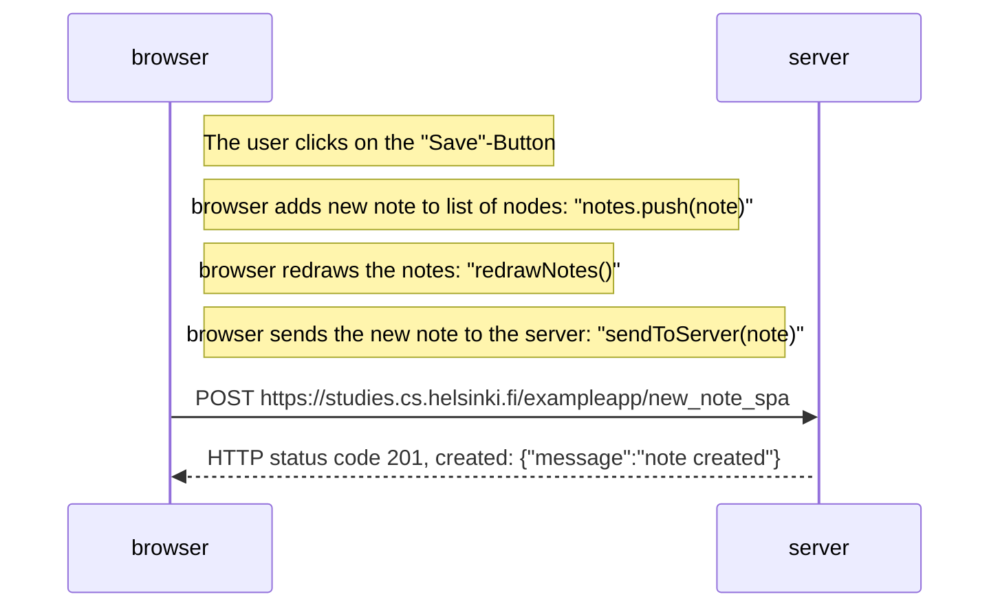

```mermaid
sequenceDiagram
    participant browser
    participant server

    Note right of browser: The user clicks on the "Save"-Button
    Note right of browser: browser adds new note to list of nodes: "notes.push(note)"
    Note right of browser: browser redraws the notes: "redrawNotes()" 
    Note right of browser: browser sends the new note to the server: "sendToServer(note)"

    browser->>server: POST https://studies.cs.helsinki.fi/exampleapp/new_note_spa
    activate server
    server-->>browser: HTTP status code 201, created: {"message":"note created"}
```